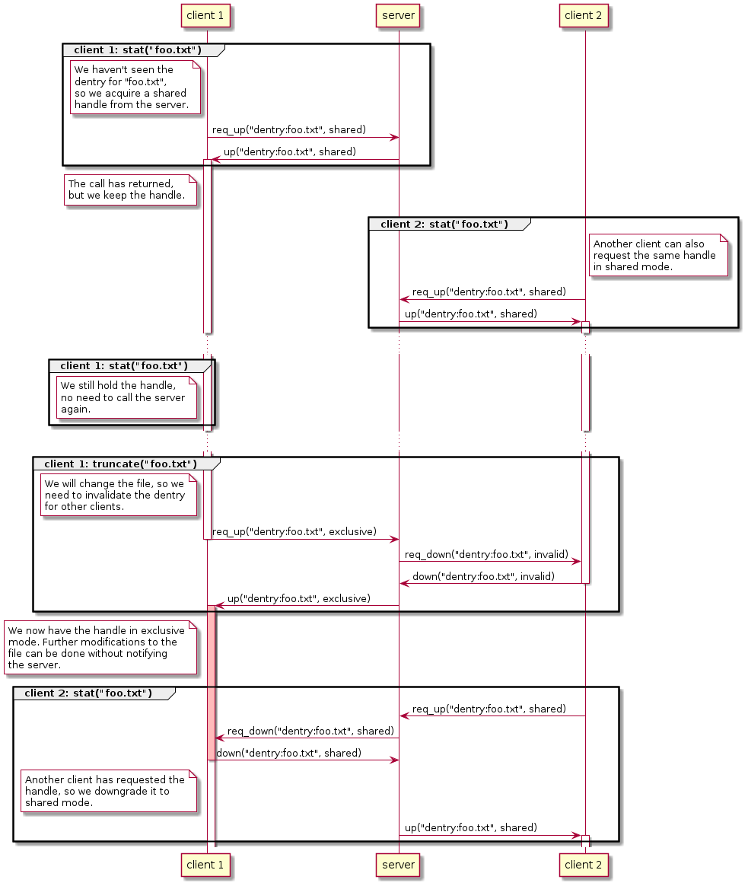
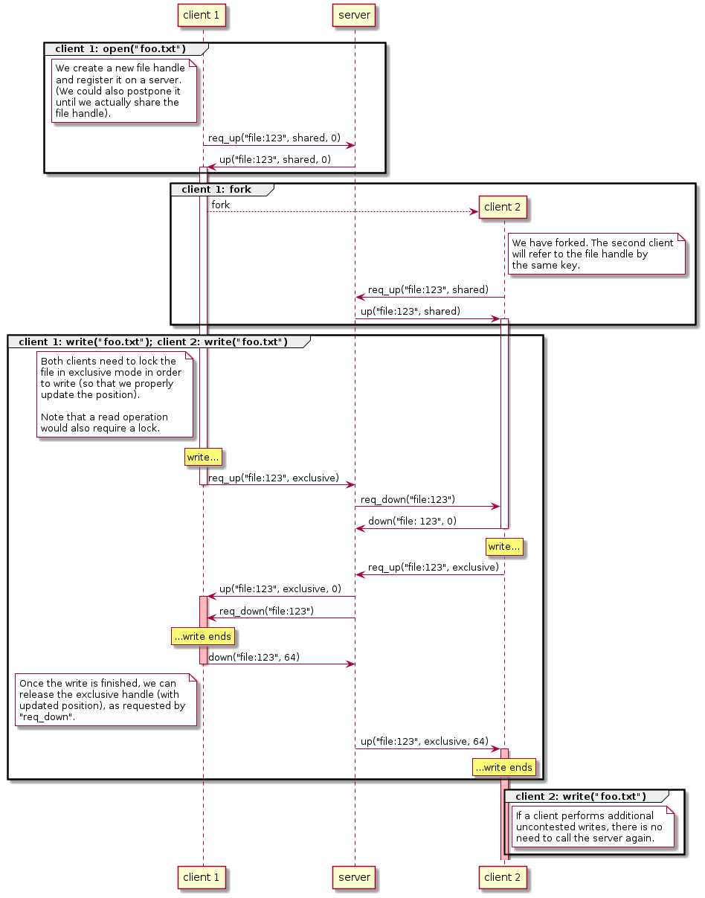

# Filesystem demo

This is a mock-up exploring a concept of a distributed filesystem for [Graphene](https://github.com/oscarlab/graphene/).

## Source Overview

* `fs.py` - filesystem code
* `demo.py` - demo code (run with `python3 demo.py demo_name`)
* `sync_client.py, sync_server.py` - the sync framework
* `ipc.py`, `util.py` - utilities and base code

## Assumptions

* There is no shared memory, only inter-process communication
* We can rely on a main process (server) always existing
* Optimize for single process using a given resource

## Filesystem architecture

We use two main objects:

* `Dentry` (directory entries): a cached view over the file system. The dentries do not contain any unwritten information and can be freely invalidated when necessary.
* `Handle` (file handle): the object backing a file descriptor. Here, it's mostly a pointer to dentry, and an integer for file position. The file position has to be synchronized between processes.

In addition, there are:

* `Mount`: information about a mounted filesystem, and a set of operations on dentries and handles.
* `SyncHandle, SyncClient, SyncServer`: the synchronization framework, see below.

## Sync handles

We use an abstraction of a **sync handle**, which is a kind of a distributed lock. A sync handle has:

* `mode`: for a given client, it can be invalid (need to be requested again), shared, or exclusive
* `data`: optionally, a small amount of data to be shared between client 
* `user_lock`: a local lock, held when the handle is in use.

The handle is not released immediately after use (that is, after `lock` is dropped), but asynchronously, when another thread needs it. This way, if a handle is not contested by other processes, it can be held indefinitely. 

See [`sync_client.py`](sync_client.py) for details of usage, and [`sync_server.py`](sync_server.py) for server implementation and protocol details.

## Example: dentry cache

Here is a detailed example of two processes accessing a file. As long as the file is only viewed, a shared handle can be held. However, when modifying a file (e.g. `truncate`), we need to tell the other clients to drop the handle, because their cached data will need to be re-acquired. 

## Example: writing to a file

In this example, two processes write to the same file handle (duplicated using `fork`). We need to accurately track the file position, so a sync handle has to be acquired in exclusive mode before writing.

Note that while we require two IPC round-trips per write, that happens only when multiple processes try writing to a file handle. If a file handle is mostly used by one process, there will be no overhead.

## Other questions

Here are some open questions and things missing from this demo:

* **No multithreading**: the demo supports multiple clients/processes, but no multiple threads accessing the same objects. That would make the implementation more complicated, but doesn't seem to be a big problem.

* **Helper thread needed for every process**: this seems inherent to the design, because we are notified asynchronously about invalidation. We already have IPC helper threads, though.

* **No reference counting**: there is no way to drop an object. This might be slightly more complicated because the handles are invalidated asynchronously.

* **Why `dentry` but not `inode`**? Same as in current Graphene implementation, it seems to me that keeping inodes would give us relatively little, and complicate the design. That's because most of our files are "remote": we call out to the host to manage them, and refer to them by path anyway.

* **How to reduce the overhead?** We still need to use IPC at least once for every dentry and every handle. Some ideas to reduce that:
  * We cannot avoid synchronizing on dentries completely, but maybe we can e.g. make the handles hierarchical and lock a whole directory.
  * The handles can be considered completely private all until the program forks. 

* **What about IDs?** The system uses string IDs, that might be inefficient.

* **How to translate it all to C?** More specifically, how to make a good, easy-to-use C API for it.

* **What about an in-memory filesystem?** That's a separate problem. I believe an in-memory filesystem can be implemented in a similar way to accessing the host files: instead of calling out to host, we call the main process over IPC; however, the other parts (dentry cache, file handles) is implemented in the same way.
